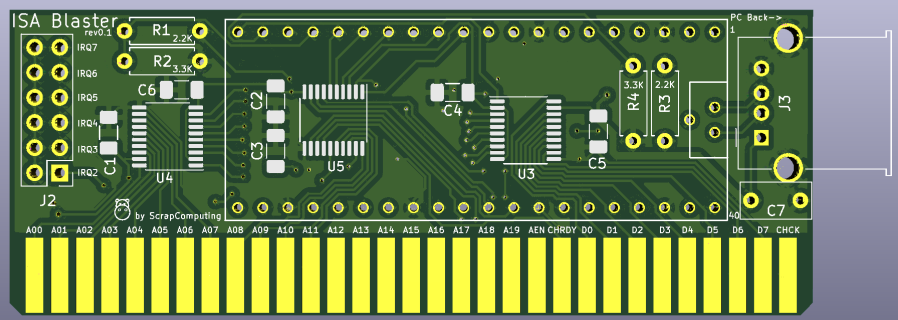
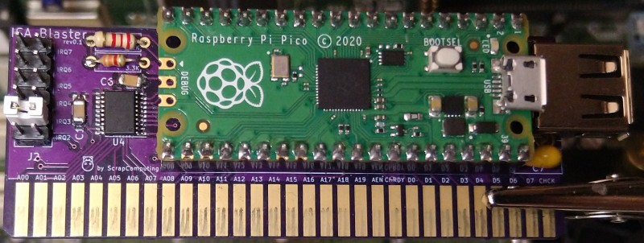

# ISA Blaster
A PCB for a software-defined ISA card powered by a Raspberry Pi Pico micro-controller.
All the logic for interfacing to the ISA bus is done in software.

# Projects based on the ISA Blaster

## DirtyRat USB Mouse Adapter
We can use the ISA Blaster as a USB mouse adapter card.
This allows you to use a USB mouse on your vintage DOS PC without the need for an external adapter.
This requires the use of:

1. The DirtyRat mouse driver for DOS: <https://github.com/scrapcomputing/DirtyRatDriver>, and
2. The DirtyRat Firmware for the Pico: <https://github.com/scrapcomputing/DirtyRatFirmware>.

# How to load the firmware
- Unplug the ISA Blaster from the motherboard
- Remove any connected USB devices (e.g., mouse)
- Press and hold the small button on the Pico
- While holding the button, connect the Pico to your PC with a micro-USB cable
- The Pico should show up as a mass-storage device
- Copy the firmware to the drive associated with the Pico
- Safely eject the mass-storage device

# Bill of materials

Gerber files are published in the releases: https://github.com/scrapcomputing/ISABlaster/releases

Item                               | # | Description
-----------------------------------|---|--------------------------------------------------------
Raspberry Pi Pico                  | 1 |
1x20-pin 2.54mm Female Headers     | 2 | For plugging in the Pico
1x20-pin 2.54mm Male Headers       | 2 | For the Pico
TXS0108EPW 20TSSOP                 | 3 | Bidirectional level-shifters 3.3V/5V
2x6 2.54mm Male Pin Headers        | 1 | For the IRQ selection
2.54mm Jumper                      | 1 | For the IRQ selection
0.1uF 1206 SMD capacitors          | 6 | Decoupling capacitors for the ICs C1-6
2.2K through-hole resistor 1/8W    | 2 | * Better to leave them unpopulated: See "Known Issues" below
3.3K through-hole resistor 1/8W    | 2 | * Better to leave them unpopulated: See "Known Issues" below
1uF through-hole ceramic capacitor | 1 | Smoothing capacitor for the board.
Horizontal Female USB connector    | 1 | For plugging in a USB device.
3-4cm short jumper wires           | 2 | For connecting Pico's TP2,TP3 pads to the PCB's pads for the on-bard USB connector

# Known Issues
- Rev0.1 connects MEMR and MEMW to voltage dividers which are made up by the 2.2K and 3.3K through-hole resistors.
  The voltage dividers can cause issues on some motherboards, so it is better to leave them unpopulated.
  This will be fixed in a later revision of the board.
